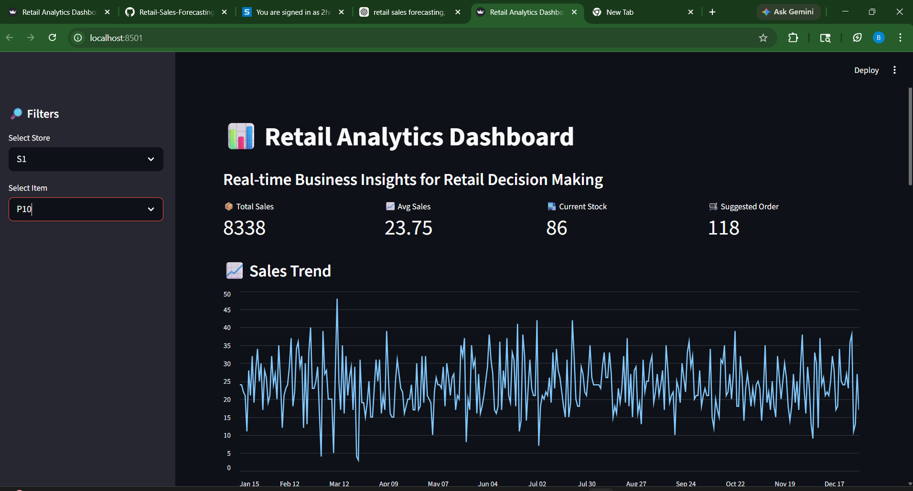
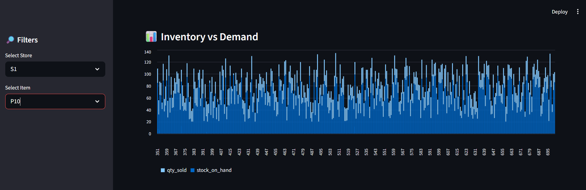
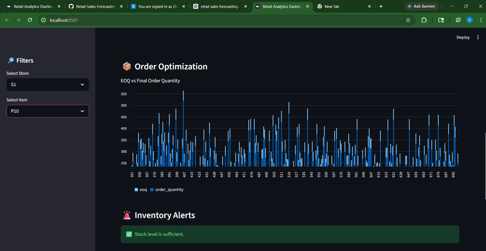
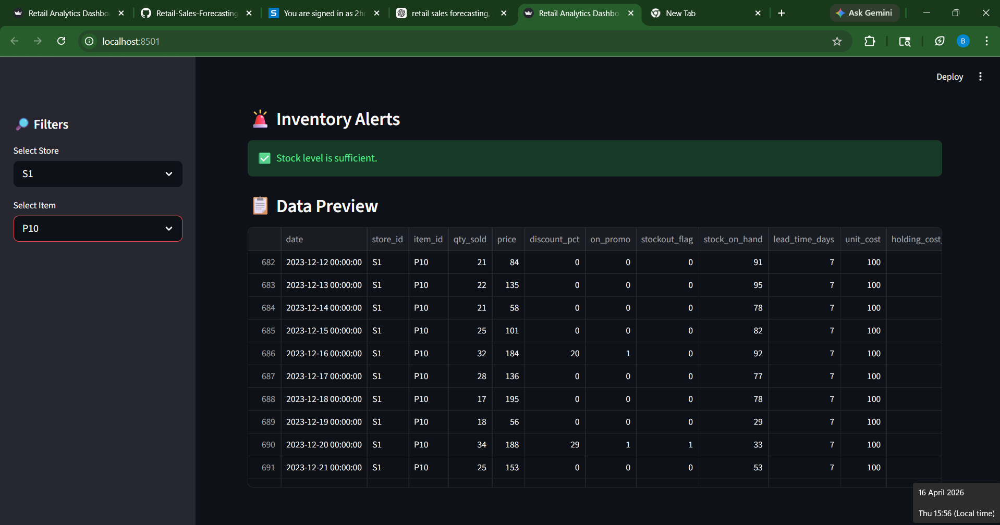
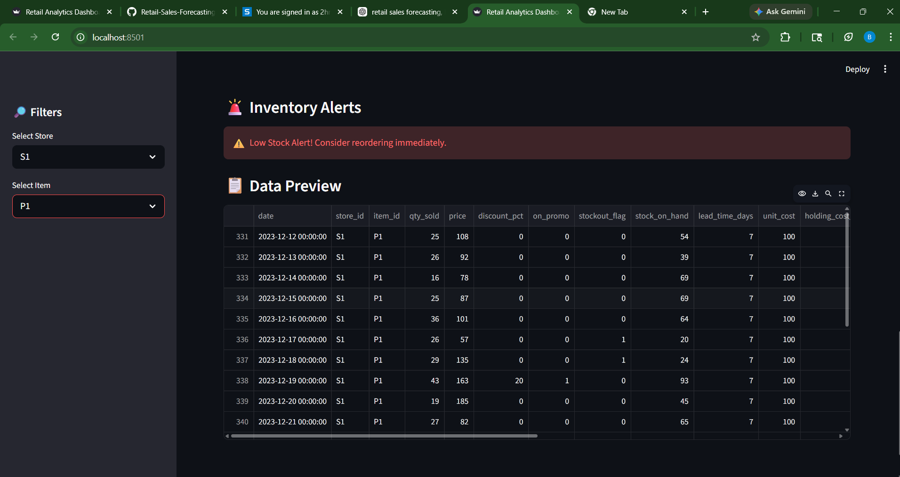

# 🛒 Retail Sales Forecasting & Inventory Optimization System

## 📌 Overview
This project builds an end-to-end retail analytics system that forecasts product demand and optimizes inventory decisions using machine learning and operations research techniques.

## 🖥️ Streamlit Dashboard Preview

<p align="center">
  
</p>

<p align="center">
  
</p>

<p align="center">
  
</p>

<p align="center">
  
</p>

<p align="center">
  
</p>
---

## 🎯 Problem Statement
Retail businesses often face:
- Stockouts → lost sales
- Overstock → blocked capital

This project solves these problems using:
- Demand Forecasting
- Inventory Optimization (Safety Stock, Reorder Point, EOQ)

---

## 💼 Business Value
- Reduces stockout risk
- Improves inventory efficiency
- Supports data-driven decision making
- Mimics real-world retail systems

---

## 🧠 Features
- 📊 Sales Forecasting using Machine Learning
- 📦 Inventory Optimization (SS, ROP, EOQ)
- 📈 Exploratory Data Analysis
- 📉 Demand Pattern Analysis
- 🖥️ Interactive Streamlit Dashboard
- 🚨 Reorder Alert System

---

## ⚙️ Tech Stack
- Python
- Pandas, NumPy
- Scikit-learn
- Matplotlib
- Streamlit

---

## 🏗️ Project Architecture
Data → Preprocessing → Feature Engineering → Model → Forecast → Inventory Optimization → Dashboard


---

## 📁 Folder Structure

(Refer project structure)

---

## ⚙️ Installation

```bash
git clone <your-repo-link>
cd Retail-Sales-Forecasting-Inventory-Optimization

python -m venv venv
venv\Scripts\activate

pip install -r requirements.txt

▶️ How to Run
1. Generate Data
python src/data_generation.py
2. Feature Engineering
python src/feature_engineering.py
3. Train Model
python src/train_model.py
4. Inventory Optimization
python src/inventory_optimization.py
5. Run Dashboard
streamlit run app/app.py

📊 Results
🔹 Forecast vs Actual
🔹 Sales Trend
🔹 Dashboard

🔬 Simulation Details
Synthetic retail dataset
Includes seasonality, promotions, and stockouts
Multi-store, multi-product simulation

## 📊 Project Screenshots

### Dashboard


### Output

